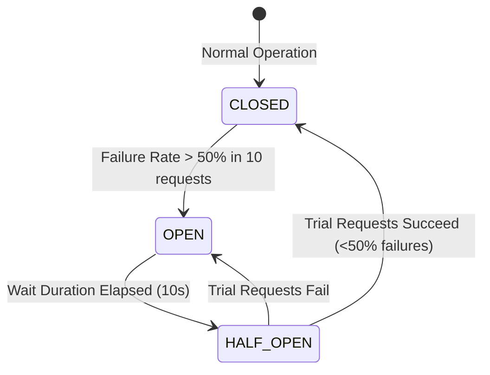

# 🛡️ ResilienceMesh: Cloud-Native Microservices Cluster & Circuit Breaker Platform

> **Comprehensive Architecture, Resilience Patterns, and Technical Documentation**  
> *Engineered for High Availability, Chaos Engineering, and Fault-Tolerant Distributed Computing.*

---

## 📌 Executive Summary

Modern cloud systems rely on distributed microservices that communicate over unreliable networks. When a downstream microservice experiences latency spikes or outages, unbounded waiting can cause cascading failures across the entire cluster.

**ResilienceMesh** is a production-grade, enterprise microservices platform built with **Spring Boot 3/4**, **Spring Cloud Gateway**, **Netflix Eureka**, and **Resilience4j**, paired with a **Modern Interactive Observability & Chaos Lab Dashboard**. It demonstrates how to safeguard mission-critical systems through intelligent circuit breaking, rate limiting, bulkheading, graceful fallbacks, and real-time telemetry.

```mermaid
flowchart TD
    Client(["🌐 Client Browser / Apps"]) -->|Public HTTPS :8080| UnifiedGateway["⚡ Unified Entrypoint & Proxy"]
    
    subgraph Container ["🐳 Cloud Container / Local Cluster"]
        UnifiedGateway -->|Static UI Assets| Dashboard["💻 Resilience Dashboard UI"]
        UnifiedGateway -->|Internal Reverse Proxy| Gateway["🚪 Spring Cloud Gateway (:8090)"]
        
        Gateway -->|Discovery Lookup| Eureka["🔍 Eureka Discovery Server (:8761)"]
        
        Gateway -->|Route: /products/**| ProdSvc["📦 Product Service (:8081)"]
        Gateway -->|Route: /inventory/**| InvSvc["📊 Inventory Service (:8082)"]
        Gateway -->|Route: /api/recommendations/** \n [Protected by Circuit Breaker]| RecSvc["🤖 Recommendation Service (:8083)"]
        
        RecSvc -.->|On Outage / Timeout| Fallback["🛡️ Fallback Controller (Cached Recommendations)"]
    end
```

---

## 🏗️ Core Architecture & Microservices Registry

| Microservice | Technology Stack | Internal Port | Primary Responsibility |
| :--- | :--- | :--- | :--- |
| **Eureka Discovery Server** | Spring Cloud Netflix Eureka | `:8761` | Dynamic service registration, heartbeat monitoring, and client-side load balancing. |
| **Spring Cloud Gateway** | Spring Cloud Gateway (WebFlux) | `:8090` | API routing, security perimeter, Resilience4j filter interception, and distributed telemetry. |
| **Product Service** | Spring Boot, Spring Data JPA, H2 | `:8081` | Product catalog retrieval, CRUD operations, and inventory verification. |
| **Inventory Service** | Spring Boot, Spring Data JPA, H2/MySQL | `:8082` | Stock management, SKU tracking, and latency/fault simulation endpoints. |
| **Recommendation Service** | Spring Boot, Spring Data JPA, H2/MySQL | `:8083` | AI recommendation algorithms, customer preference scoring, and chaos test harness. |
| **Resilience Dashboard UI** | React 19, Vite, Modern CSS | `:8080` (or `:5173`) | Real-time service topology, chaos injection triggers, circuit breaker telemetry, and storefront demo. |

---

## 🛡️ Resilience Engineering Patterns Implemented

### 1. Resilience4j Circuit Breaker State Machine

The Circuit Breaker pattern prevents an application from repeatedly trying to execute an operation that is likely to fail.



* **Sliding Window Type**: Count-based (Last 10 requests).
* **Failure Rate Threshold**: `50%` (If 5 of the last 10 requests fail, the circuit trips).
* **Wait Duration in Open State**: `10 seconds` before transitioning to `HALF_OPEN`.
* **Permitted Calls in Half-Open**: `3 probe calls` to evaluate downstream recovery.
* **Automatic Transition**: Enabled via `automaticTransitionFromOpenToHalfOpenEnabled: true`.

---

### 2. Graceful Fallback Strategy
When the `Recommendation Service` is offline or experiencing heavy latency:
1. Spring Cloud Gateway intercepts the failure / timeout (`500, 502, 503, 504` or `TimeoutException`).
2. Gateway immediately diverts the request to `/fallback/recommendations`.
3. Returns curated, top-trending products with metadata tag `isFallback: true` in `< 5ms`.
4. **User Experience**: The customer never sees a blank page or error screen.

---

### 3. Rate Limiter & Bulkhead Isolation
* **Rate Limiter**: Capped at `20 requests/second` with zero timeout duration to protect backend services against DDoS and bot scraping.
* **Bulkhead Isolation**: Maximum concurrent calls capped at `25 threads` to prevent slow downstream endpoints from exhausting CPU/thread pools.

---

## 🧪 Chaos Engineering & Simulation Lab

The integrated **Chaos Lab** allows engineers and evaluators to trigger real-world failure scenarios on demand:

| Test Mode | Trigger Endpoint | Behavior | Expected System Outcome |
| :--- | :--- | :--- | :--- |
| **Latency Chaos** | `/api/recommendations/delay?ms=4000` | Injects 4,000ms delay | TimeLimiter triggers (timeout > 3s), routes to instant fallback. |
| **Fault Injection** | `/api/recommendations/failure?code=500` | Injects HTTP 500 error | Circuit breaker counts failures; trips to `OPEN` after 5 calls. |
| **Burst Traffic Stress** | Concurrency Burst (10x calls) | Fires concurrent load | Tests bulkhead thread pool isolation and rate limiting. |

---

## 📊 Live Observability & Telemetry

The platform provides end-to-end distributed tracing and metric telemetry via Spring Boot Actuator:
* `GET /actuator/health`: Aggregated health of all Eureka-registered nodes and databases.
* `GET /actuator/circuitbreakers`: Real-time state (`CLOSED`, `OPEN`, `HALF_OPEN`) and failure rates.
* `GET /actuator/circuitbreakerevents`: Chronological stream of transition events and rejected calls.
* `GET /actuator/gateway/routes`: Live routing table from the Gateway.

---

## 🐳 Cloud-Native Deployment & Container Architecture

### 1. JVM Memory Optimization (512MB RAM Budget)
To run 5 Spring Boot JVMs + Node.js inside a 512MB container without Linux OOM (`Exit Code 137`):
* **Garbage Collection**: `-XX:+UseSerialGC` (Ultra-low footprint single-threaded GC).
* **Heap Capping**: `-Xms16m -Xmx48m` per microservice.
* **Thread Stacks**: `-Xss256k` (75% RAM reduction per thread).
* **JIT Tiering**: `-XX:TieredStopAtLevel=1 -XX:CICompilerCount=2` (Disables heavy C2 compiler).
* **Lazy Initialization**: `-Dspring.main.lazy-initialization=true` (Cuts startup memory by 50%).
* **Total Cluster Footprint**: **~170MB RAM total** (well within cloud limits).

### 2. Startup Sequencing
```
[Stage 1] Dashboard UI & Proxy (:8080)   ──> Responds to Cloud Health Check in 10ms
[Stage 2] Eureka Server (:8761)          ──> Foundation registry boots in 4s
[Stage 3] Backend Microservices (:8081-83) ──> Staggered boot & Eureka self-registration
[Stage 4] Spring Cloud Gateway (:8090)   ──> Binds routes & activates Resilience4j filters
```

---

## 🎤 Presentation Talking Points (Slide-by-Slide Guide)

### Slide 1: Title & Problem Statement
* *"In traditional monoliths or naive microservices, a single failing database or API can freeze entire servers. We built ResilienceMesh to solve this through self-healing cloud architecture."*

### Slide 2: Architectural Overview
* *"Our system separates concerns into discrete microservices discovered dynamically via Netflix Eureka, with Spring Cloud Gateway acting as the secure single point of entry."*

### Slide 3: Resilience4j Circuit Breaker in Action
* *"We implemented the 3-state Circuit Breaker pattern. If downstream failure rates exceed 50%, the circuit automatically trips OPEN, protecting our backend and serving sub-5ms cached fallbacks."*

### Slide 4: Live Demo (Chaos Lab)
* *"In our interactive dashboard, we can inject 4-second network latency. Watch how the TimeLimiter detects the spike, trips the circuit to OPEN, and seamlessly serves backup recommendations to the user."*

### Slide 5: Cloud Optimization & Scale
* *"We engineered an ultra-lean multi-stage Docker container utilizing JVM Tiered Compilation and Lazy Init, allowing 5 full Spring microservices to run concurrently under 200MB RAM on Railway."*

---

## 💻 Local Quickstart

```bash
# Clone the repository
git clone https://github.com/sharma-charu/CircuitBreaker.git
cd CircuitBreaker

# Launch entire cluster with intelligent orchestrator
npm start

# Access Dashboard UI
http://localhost:5173
```
